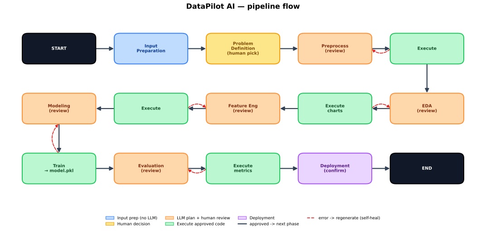

# DataPilot AI

An agentic assistant that walks a dataset through the full data-science pipeline
— **problem definition → preprocessing → EDA → feature engineering → modeling →
evaluation → deployment** — proposing the code at each step and **pausing for
human approval** before anything runs.

Built with **LangGraph** (workflow) + **Streamlit** (UI) + a pluggable LLM
backend (a **local Ollama model** by default, or a cloud model like Gemini or
Groq) for code generation.

## Pipeline graph



**How to read it:** the flow snakes left→right, then right→left, then
left→right. Each phase: the LLM writes code, **✋ you review / edit / approve it**
(LangGraph's `interrupt()`), then it runs. Solid arrows advance on success; the
**dashed red** arrows are the self-healing loop — a failed run feeds the error
back to the planner for a fresh attempt. _(Diagram: `docs/pipeline.svg` —
regenerate with `python docs/pipeline_diagram.py`.)_

## Quickstart (local model, no API key)

The default model is **Qwen2.5-Coder 7B** running locally via
[Ollama](https://ollama.com) — no API key, no rate limits, works offline.

```bash
# 1. Install Ollama (https://ollama.com/download), then pull the model:
ollama pull qwen2.5-coder:7b
#    Ollama runs a local server automatically; to start it manually: `ollama serve`

# 2. Install deps and launch the UI
uv run streamlit run ui/app.py
```

Then upload a CSV (e.g. the included `Housing.csv`), type a goal like
"Predict house price", and click **Run workflow**.

### Model selection

Pick the model from the **sidebar dropdown**:

- **Qwen2.5-Coder 7B (Ollama)** — local, free, offline (default). Needs ~5–6 GB
  of RAM/VRAM; runs best on a GPU or Apple Silicon. See
  [docs/OLLAMA_SETUP.md](docs/OLLAMA_SETUP.md). Smaller/local models make more
  mistakes, but the app's self-healing retry loop recovers from most.
- **Gemini 2.0 Flash (Google)** — capable, cloud. Get a key at
  <https://aistudio.google.com/apikey> and set `GOOGLE_API_KEY` in `.env`.
- **Groq (Llama 3.3 / GPT-OSS)** — fast, cloud. Get a key at
  <https://console.groq.com/keys> and set `GROQ_API_KEY` in `.env`.

To change the default model, edit `DEFAULT_MODEL` in
[`utils/llm.py`](utils/llm.py) (the only place model config lives).

## Documentation

- **[docs/HOW_IT_WORKS.md](docs/HOW_IT_WORKS.md)** — a from-scratch explanation of
  how the app works and a guided tour for reading the code.
- **[docs/OLLAMA_SETUP.md](docs/OLLAMA_SETUP.md)** — install Ollama + the local
  model, hardware needs, and troubleshooting.

## How a phase works (the standard)

Every phase follows one pattern:

```
planner node (LLM writes code) → interrupt() → you approve/edit → executor runs code
                                                   ↑                         │
                                                   └──── on error, regenerate ┘
```

Shared building blocks live in
[`workflows/nodes/phase_base.py`](workflows/nodes/phase_base.py),
[`utils/hitl.py`](utils/hitl.py), [`utils/code_exec.py`](utils/code_exec.py), and
[`agents/code_agent.py`](agents/code_agent.py).

## Tests

```bash
# Offline (no model needed — the LLM is stubbed):
uv run --with pytest python -m pytest tests/test_pipeline_offline.py tests/test_code_exec.py tests/test_code_agent.py -q
# Live end-to-end (needs a working model: Ollama running, or a cloud key in .env):
uv run python -m tests.test_pipeline
```

## Security note

This app **executes LLM-generated Python in-process**, gated by explicit human
approval (you see and can edit every snippet before it runs). A risk scanner
flags code that touches the filesystem/network/etc. Do not run it against
untrusted CSVs without reviewing the generated code.
